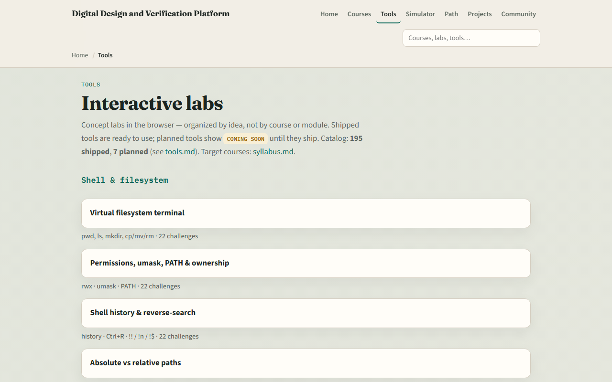

# Module 00 — Welcome to Git for coursework

**Module id:** module00-intro  
**Lab:** none (intro)  
**Tracks:** A · B (course setup)

## Slide 1 — Welcome to Git for coursework

In coursework and delivery, you will live in Git. You will clone a template, commit progress, open a pull request, and recover when something goes wrong—all from a real repository. This short clip welcomes you to learn Git, and shows how the course is meant to be used.

## Slide 2 — Why Git matters

Coursework is not just “save the file.” You need a history you can explain, a branch you can share, and a submission others can reproduce. Later labs—Make, simulators, and verification flows—assume you can commit cleanly, read a log, and talk about remotes without panic. Getting comfortable here pays off in every later course.

## Slide 3 — Two tracks, one idea

Every lab module offers two ways to practice. The real Git track uses your own terminal—Linux, macOS, or WSL on Windows—so commits, branches, and remotes feel real. The browser lab track uses interactive tools on the learning platform, so you can build intuition without installing anything. You may do either track, or both. The usual rhythm is browser first for the idea, then real Git for muscle memory.

## Slide 4 — Set up the real Git track

Open a terminal. On Windows, prefer WSL—Windows Subsystem for Linux—so you get a real Unix shell with Git. Confirm Git is installed by asking for its version. From the learn Git course folder, run the scaffold script once. That script only creates a small practice tree under your home directory where checklist exercises can live safely; it does not install course tools. Skim the sandbox note once—you will use a live practice repo later in the path.

## Slide 5 — Set up the browser lab track

From the monorepo, serve the platform folder with a simple local web server, then open the tools index in your browser. Serving the folder means your browser can load the interactive labs as ordinary web pages. If you prefer, use the published tools site instead. Either way, you only need to confirm you can reach the labs—the next module will send you into the Git mental model lab.

## Slide 6 — How to move through modules

For each module, read the README for the outcome, pick a track—or both—then work the checklist. When you finish this intro checklist, continue to the first lab module: the Git mental model.
