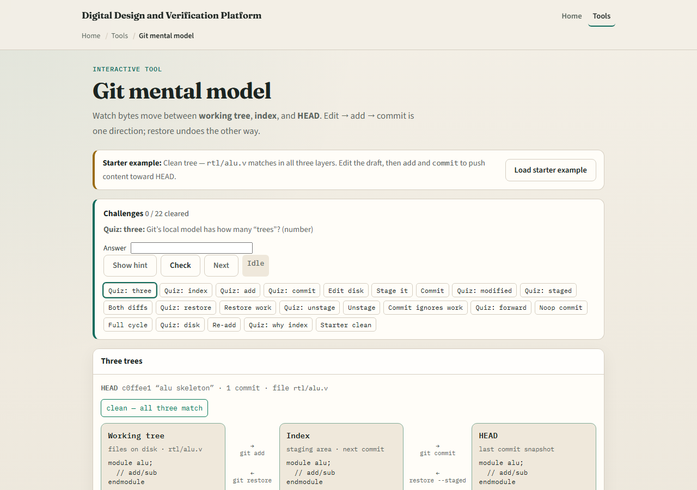
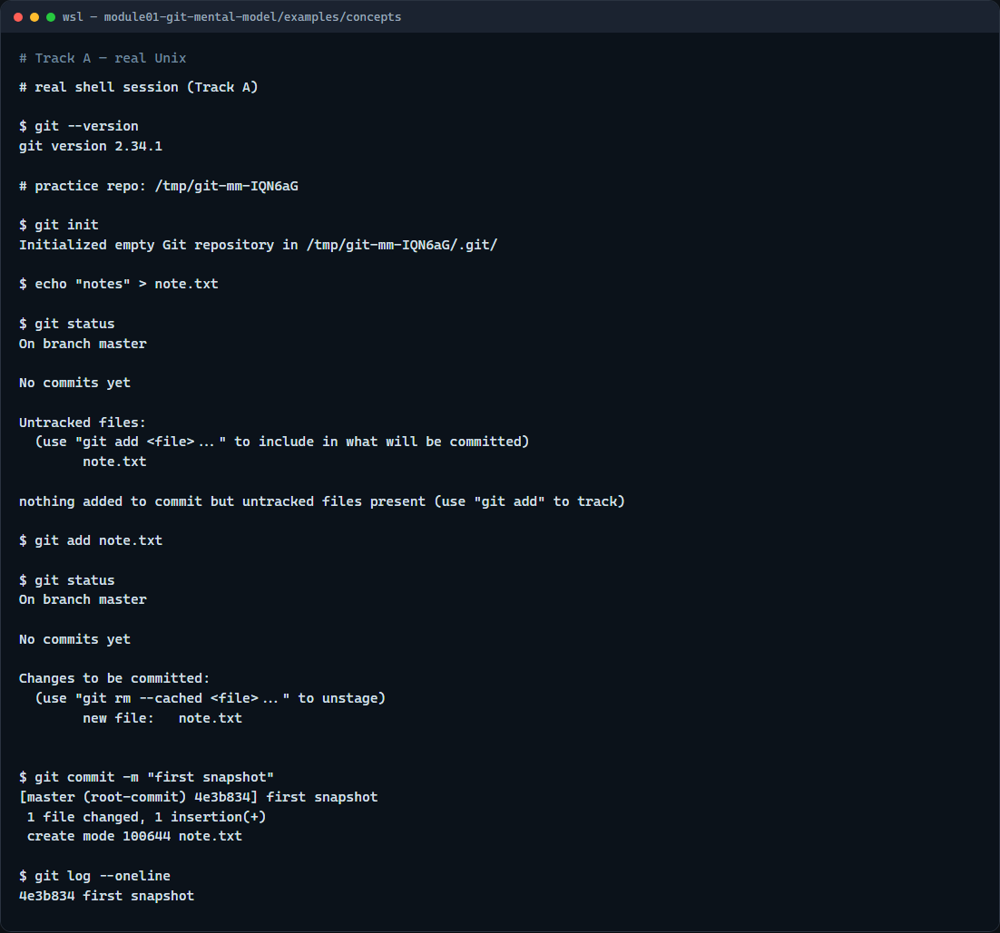

# Module 01 — Git mental model

**Module id:** module01-git-mental-model  
**Lab:** git-mental-model  
**Tracks:** A · B

## Slide 1 — Git mental model

This module is the picture you keep in your head while you use Git. Coursework is not only “save the file”—you move changes from the files on disk, through a staging area, into a commit you can explain later. We will use the browser lab for intuition, then the same flow on real Git.

## Slide 2 — Three places for your changes

Git keeps three related views of a project. The working tree is what you see and edit on disk. The staging area—also called the index—is what you have prepared for the next snapshot. HEAD is the last commit: the durable history you already recorded. You move content forward with add, then commit. You can move it back with restore when you need to undo a step safely.

## Slide 3 — Browser lab



In the browser lab, look at three pieces: the challenge card, the three-trees diagram—working tree, index, and HEAD—and the edit and move buttons under it. Load the starter example so all three layers match. Try one small edit, then add, then commit, and use Check when you think the challenge is done. You do not need a full tour here—the lab itself guides the rest. Explore a few challenges, then come back for the real Git track.

## Slide 4 — Real Git practice



In the real Git track, open a terminal and confirm Git is installed by asking for its version. Then create a tiny practice repo, write a short note file, and run status so you can see what is untracked in the working tree. Add that file to stage it for the next commit, run status again to see it staged, then commit with a short message to record a snapshot in history. Finally, show a one-line log so you can see that commit in the chain. Those moves—status, add, commit—are the muscle you will reuse in every later module.

```bash
# git --version — confirm Git is installed
git --version

# git init — create a new repository here
git init

# echo … > note.txt — create a file in the working tree
echo "notes" > note.txt

# git status — what is modified, staged, or untracked?
git status

# git add note.txt — copy the change into the staging area
git add note.txt

# git status — confirm it is staged for commit
git status

# git commit -m "…" — record a snapshot from what is staged
git commit -m "first snapshot"

# git log --oneline — show recent commits, one line each
git log --oneline
```

## Slide 5 — Pitfalls to watch

Do not treat the staging area as optional decoration—commit only records what you staged. Do not confuse “saved in the editor” with “committed in Git.” And remember: the browser lab is for literacy—remotes, pull requests, and submissions still belong on real Git.

## Slide 6 — Your turn

Complete the checklist for at least one track—preferably both. In the browser, load the starter and finish a few challenges. On real Git, repeat status, add, and commit in your practice tree. When you are ready, take the short quiz, then continue to the next module: the graph, stage, and commit playground.
