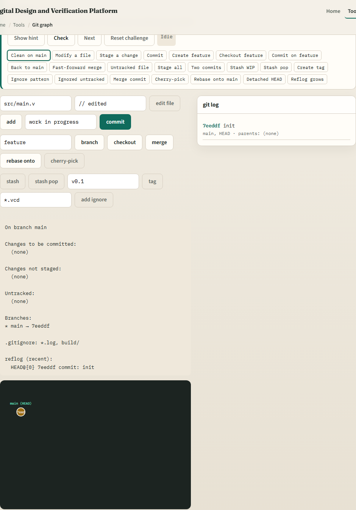
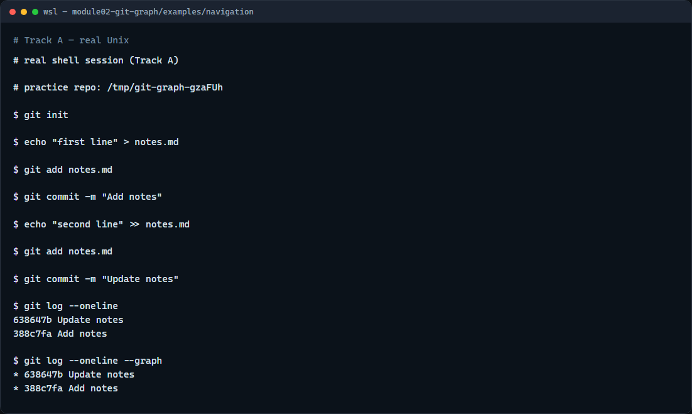

# Graph, stage, commit (playground)

You already know the three places Git keeps your work: the working tree, the staging area, and the last commit

---

## History is a growing graph
- Think of commits as beads on a string
- The first commit has no parent; every later commit points at the one before it
- Staging is still the gate: you add changes, then commit to create the next bead
- The log is how you read that chain
- Branching and merging add forks later

---

## Browser lab


---

## Real Git practice


---

## Real Git practice — try these

```
# git init — create a new repository here
git init

# echo … > notes.md — create a file in the working tree
echo "first line" > notes.md

# git add notes.md — stage the file for the next commit
git add notes.md

# git commit -m "…" — record the first snapshot
git commit -m "Add notes"

# echo … >> notes.md — append another line (working tree changes)
echo "second line" >> notes.md

# git add notes.md — stage the update
git add notes.md

# git commit -m "…" — record the second snapshot on top of the first
git commit -m "Update notes"

# git log --oneline — one line per commit (newest first)
git log --oneline

# git log --oneline --graph — same list with parent links drawn
git log --oneline --graph

```

---

## Pitfalls to watch
- Do not commit without staging first, an empty staging area means nothing new to record
- Do not assume the graph updates when you only save in the editor
- And remember

---

## Your turn
- Complete the checklist for at least one track, preferably both
- In the browser, load the starter and finish a few graph challenges
- On real Git, repeat add, commit
- When you are ready

