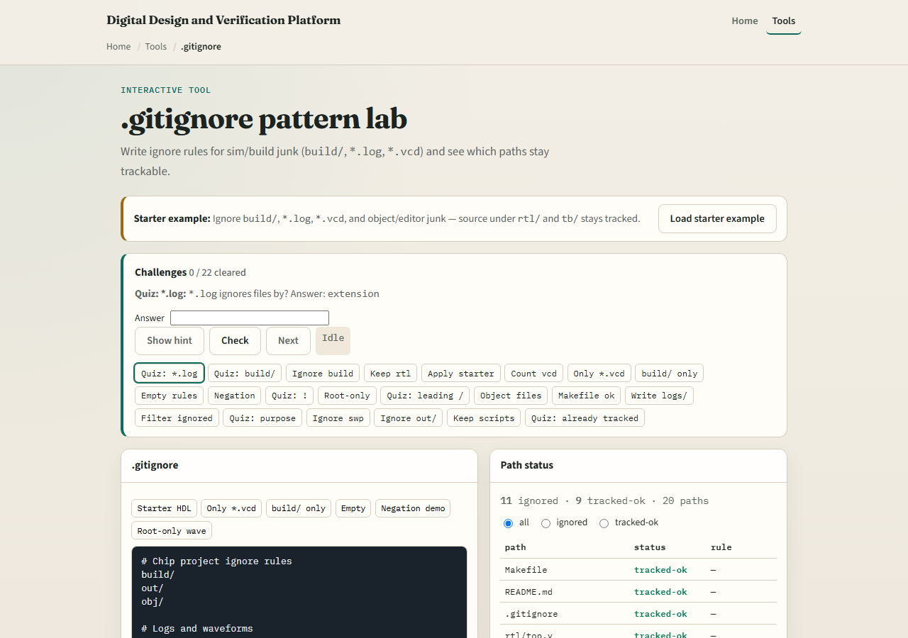
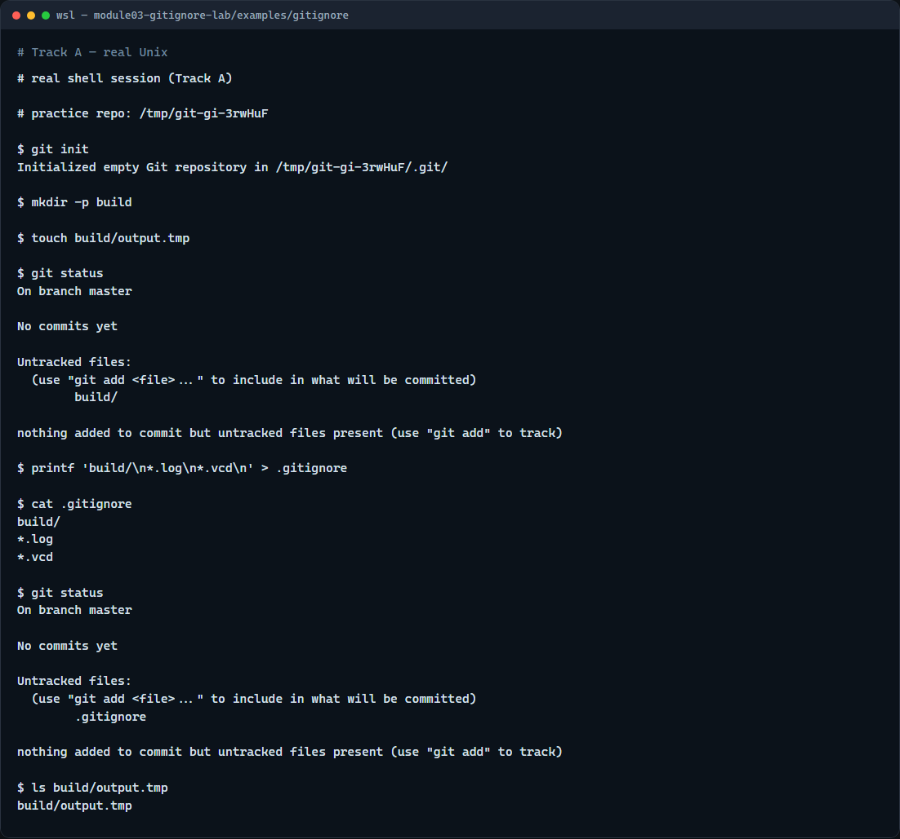

# Module 03 — .gitignore patterns

**Module id:** module03-gitignore-lab  
**Lab:** gitignore-lab  
**Tracks:** A · B

## Slide 1 — .gitignore patterns

Simulators and builds leave junk behind—logs, waveform dumps, object files, whole output folders. You want those on disk for debugging, but you do not want them in history. This module teaches `.gitignore`: patterns that keep generated paths out of status and out of commits.

## Slide 2 — Ignore means “do not track”

A `.gitignore` file lives at the repo root and lists patterns. Matching untracked paths disappear from status and will not be added by mistake. Typical design patterns ignore a build directory, log files, and waveform dumps. Remember: ignore rules apply to untracked files—if something is already committed, ignore alone will not remove it from history.

## Slide 3 — Browser lab



In the browser lab, look at three pieces: the challenge card, the ignore-rules editor, and the path-status list that shows what stays trackable. Load the starter example so build and log patterns are already in place. Change a rule or filter the path list, then use Check when you think the challenge is done. You do not need a full tour here—the lab itself guides the rest. Explore a few challenges, then come back for the real Git track.

## Slide 4 — Real Git practice



In the real Git track, open a tiny practice repo and create a build folder with a dummy output file. Run status first—you should see that output as untracked. Then write a `.gitignore` that ignores the build directory, and run status again. The generated file should vanish from the list even though it still exists on disk. That is the habit you want before you commit coursework trees full of simulator noise.

```bash
# git init — create a new repository here
git init

# mkdir -p build — make a build output folder
mkdir -p build

# touch build/output.tmp — fake a generated file
touch build/output.tmp

# git status — see the untracked build output
git status

# printf … > .gitignore — ignore the build/ directory
printf 'build/\n*.log\n*.vcd\n' > .gitignore

# git status — build output should no longer appear
git status
```

## Slide 5 — Pitfalls to watch

Do not commit large regenerated files and then add ignore later—clean them up first if they already landed in history. Do not ignore your RTL or testbench sources by accident with a broad star pattern. And remember: the browser lab is for literacy—real submissions still need a solid `.gitignore` in a real repo.

## Slide 6 — Your turn

Complete the checklist for at least one track—preferably both. In the browser, load the starter and finish a few challenges. On real Git, copy or adapt the sample ignore file from this module’s examples into your practice tree and confirm status stays clean. When you are ready, take the short quiz, then continue to the next module on commit messages.
