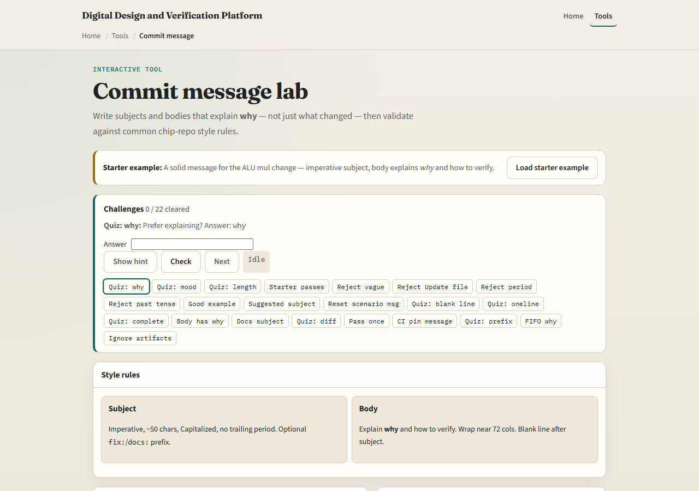
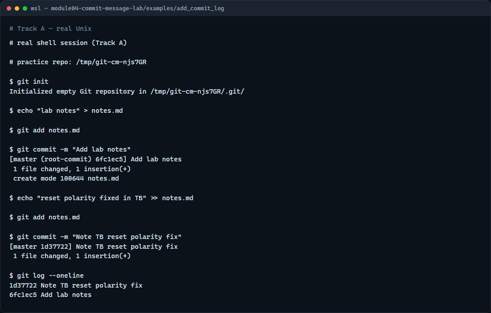

# Module 04 — Commit messages

**Module id:** module04-commit-message-lab  
**Lab:** commit-message-lab  
**Tracks:** A · B

## Slide 1 — Commit messages

A commit is a snapshot; the message is how humans find it later. In coursework and delivery, a vague note like “fixed stuff” wastes everyone’s time. This module practices writing subjects and bodies that explain why a change happened—and how someone can verify it.

## Slide 2 — Subject first, why next

Keep the subject short, imperative, and about fifty characters or less—think “Add mul path to ALU,” not “Added files.” Put a blank line, then a body when the change needs context: why you did it, and how to check it—for example, which make target or testbench to run. The log becomes a readable story, not a pile of filenames.

## Slide 3 — Browser lab



In the browser lab, look at three pieces: the challenge card, the style-rules panel, and the compose box for subject and body. Load the starter example, try a weak message and a strong one, and watch the checks light up. Use Check when you think a challenge is done. You do not need a full tour here—the lab itself guides the rest. Explore a few challenges, then come back for the real Git track.

## Slide 4 — Real Git practice



In the real Git track, create a tiny practice repo, add a notes file, and commit it with a clear imperative subject. Make a second small edit, stage it, and commit again with a message that says what changed and why it matters. Then show a one-line log so you can read those subjects as a timeline. Prefer that habit over one-word messages you will not understand next week.

```bash
# git init — create a new repository here
git init

# echo … > notes.md — create a file in the working tree
echo "lab notes" > notes.md

# git add notes.md — stage the new file
git add notes.md

# git commit -m "…" — record with an imperative subject
git commit -m "Add lab notes"

# echo … >> notes.md — append a second line
echo "reset polarity fixed in TB" >> notes.md

# git add notes.md — stage the update
git add notes.md

# git commit -m "…" — explain why in the subject
git commit -m "Note TB reset polarity fix"

# git log --oneline — show short hash plus subject
git log --oneline
```

## Slide 5 — Pitfalls to watch

Do not end the subject with a period, and do not paste a whole diff into the subject line. Avoid past-tense “Added” when style calls for imperative “Add.” And remember: a perfect message on a concept lab still needs the same discipline in the real repo you submit.

## Slide 6 — Your turn

Complete the checklist for at least one track—preferably both. In the browser, load the starter and rewrite a few weak messages until the checks pass. On real Git, make two small commits with subjects you would be willing to show a teammate. When you are ready, take the short quiz, then continue to the next module on git log options.
