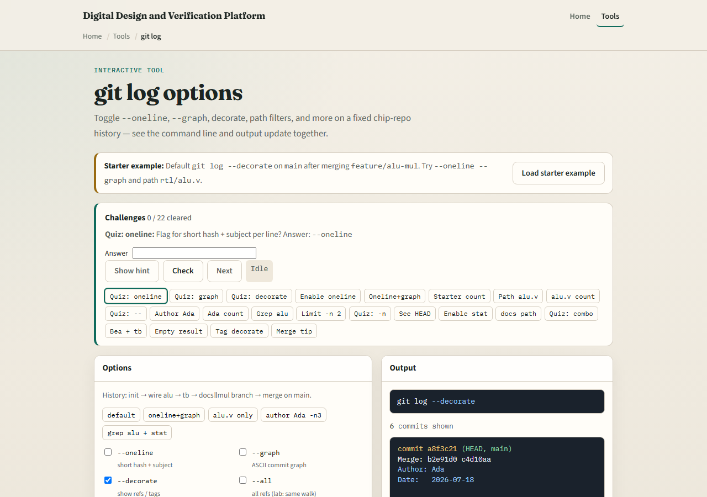
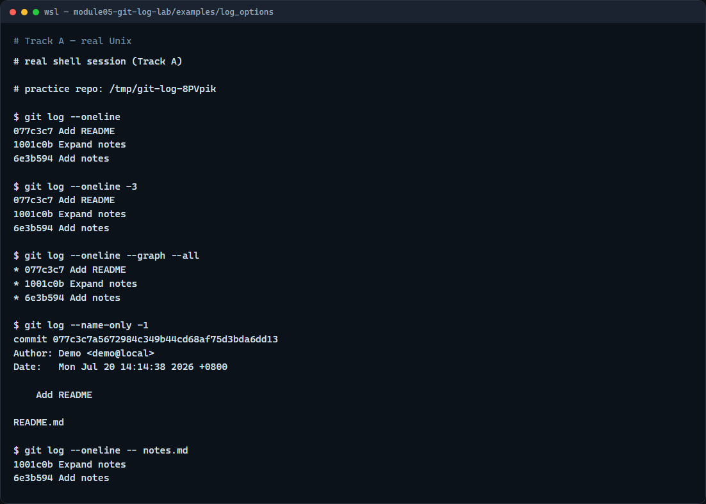

# Module 05 — git log options

**Module id:** module05-git-log-lab  
**Lab:** git-log-lab  
**Tracks:** A · B

## Slide 1 — git log options

History is only useful if you can read it. Full `git log` dumps author blocks; flags let you scan subjects, see branch shape, or focus on one file. This module practices the options you will reach for before a review, a merge, or a late-night debug.

## Slide 2 — Scan, graph, then zoom

Start with oneline for a short hash plus subject. Add a count like minus five when you only need the recent tip. Use graph with all to sketch how branches meet. When you need detail, name-only lists paths touched, and a path filter after two dashes limits history to one file—perfect for “who last touched this RTL?”

## Slide 3 — Browser lab



In the browser lab, look at three pieces: the challenge card, the options checkboxes—oneline, graph, and friends—and the live output pane that mirrors the command line. Load the starter example, toggle a few flags, and watch the history rewrite. Use Check when you think a challenge is done. You do not need a full tour here—the lab itself guides the rest. Explore a few challenges, then come back for the real Git track.

## Slide 4 — Real Git practice



In the real Git track, seed a tiny repo with a couple of commits on notes, then print a one-line history. Limit it to the last few commits, then add graph with all so you see the topology even on a short line of history. List names changed in the latest commit, and finally filter the log to only commits that touched the notes file. Those four views—scan, limit, graph, path—cover most day-to-day history work.

```bash
# git log --oneline — short hash plus subject for each commit
git log --oneline

# git log --oneline -3 — only the last three commits
git log --oneline -3

# git log --oneline --graph --all — compact history with branch shape
git log --oneline --graph --all

# git log --name-only -1 — paths touched by the latest commit
git log --name-only -1

# git log --oneline -- notes.md — commits that touched this path
git log --oneline -- notes.md
```

## Slide 5 — Pitfalls to watch

Do not confuse a path filter—two dashes then a path—with a branch name. Remember that graph without oneline can be noisy on a long history. And remember: the browser lab is for literacy—real merges and reviews still need these flags in a real shell.

## Slide 6 — Your turn

Complete the checklist for at least one track—preferably both. In the browser, load the starter and clear a few option challenges. On real Git, practice oneline, a limit, graph, and a path filter in your practice tree. When you are ready, take the short quiz, then continue to the next module on safe undo.
