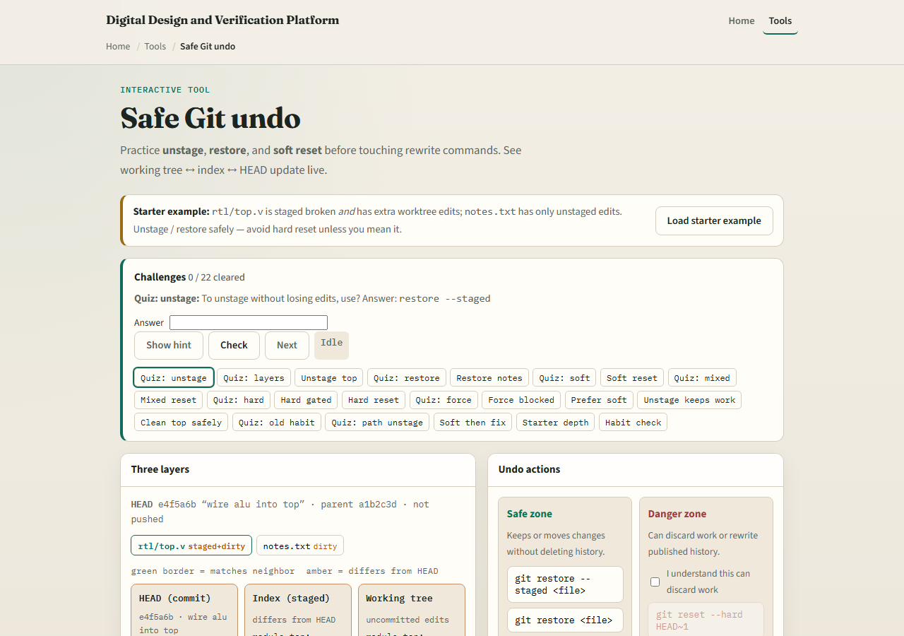
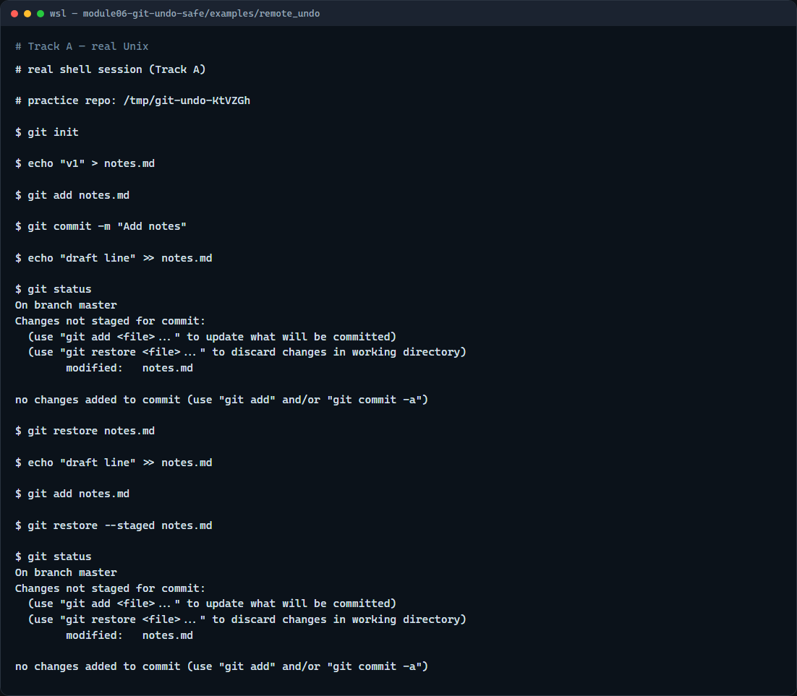

# Safe undo

You will edit the wrong file, stage too early, or want to back out of a local mistake

---

## Restore before reset
- To drop unstaged edits in a tracked file
- To unstage without losing your edits
- Soft reset moves HEAD back while keeping your staged work; mixed reset also unstages
- Hard reset throws away local changes, save that for when you truly mean it

---

## Browser lab


---

## Real Git practice


---

## Real Git practice — try these

```
# git init — create a new repository here
git init

# echo … > notes.md — create and commit a tracked file
echo "v1" > notes.md
git add notes.md
git commit -m "Add notes"

# echo … >> notes.md — edit without staging
echo "draft line" >> notes.md

# git status — see modified, not staged
git status

# git restore notes.md — discard unstaged edits
git restore notes.md

# echo … >> notes.md — edit again
echo "draft line" >> notes.md

# git add notes.md — stage the change
git add notes.md

# git restore --staged notes.md — unstage, keep edits on disk
git restore --staged notes.md

# git status — modified but not staged
git status

```

---

## Pitfalls to watch
- Do not confuse unstage with discard, restore staged keeps your edits
- Avoid reset hard until you have tried restore and soft or mixed reset
- And remember

---

## Your turn
- Complete the checklist for at least one track, preferably both
- In the browser, load the starter and practice unstage versus restore on a few challenges
- On real Git, repeat restore and restore staged in your practice tree
- When you are ready

