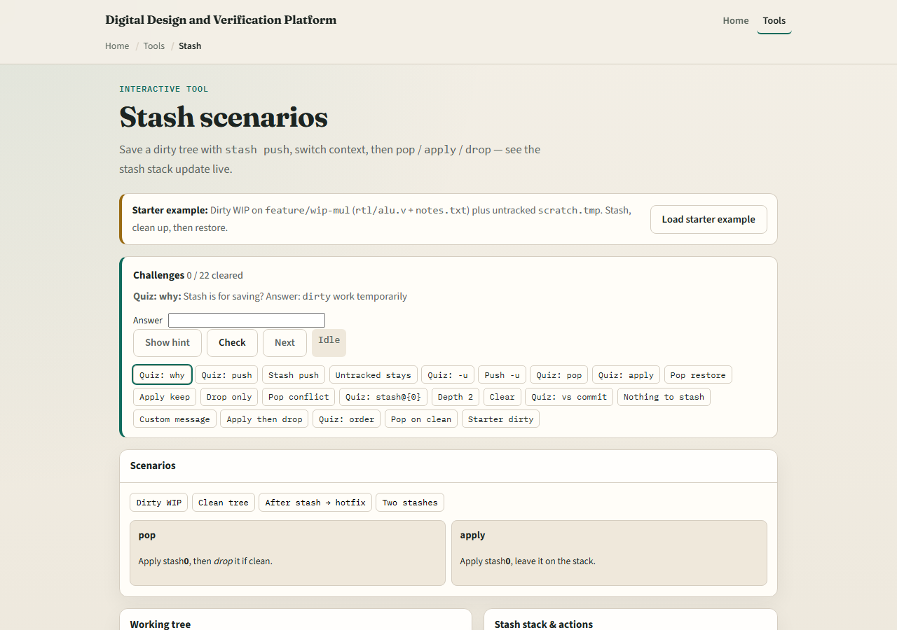
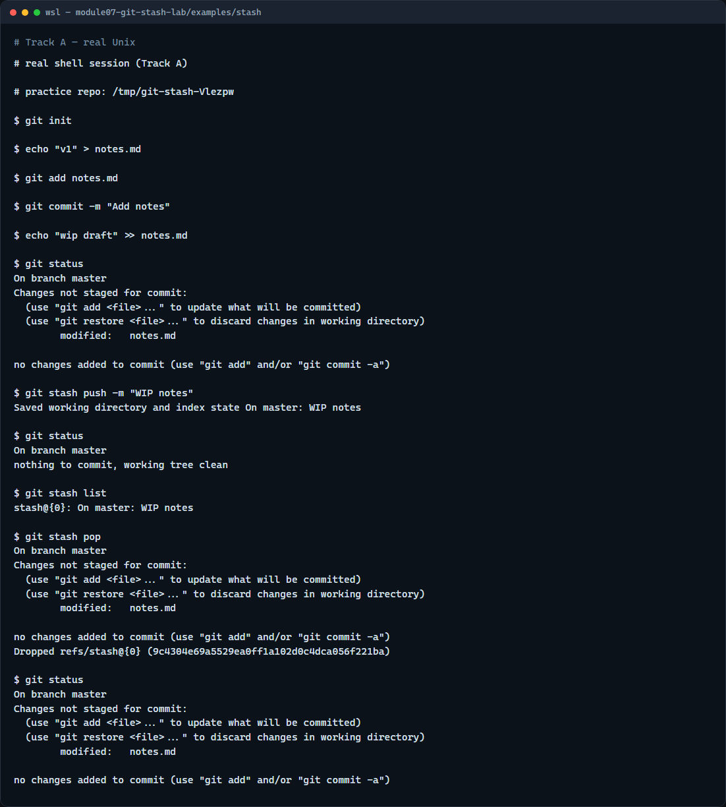

# Module 07 — Stash scenarios

**Module id:** module07-git-stash-lab  
**Lab:** git-stash-lab  
**Tracks:** A · B

## Slide 1 — Stash scenarios

Sometimes you are mid-edit and need a clean tree—to switch branches, pull updates, or run a quick experiment. Stash saves your uncommitted work on a side stack and restores a clean working tree. This module practices push, list, apply, and pop so you can pause without committing half-baked changes.

## Slide 2 — Push, list, then pop or apply

Stash push saves tracked dirty files and resets the working tree to match HEAD. Stash list shows the stack—newest on top. Stash pop applies the top entry and removes it from the stack; stash apply puts changes back but leaves the entry for safety. By default stash does not include untracked files; add minus u when you need those too.

## Slide 3 — Browser lab



In the browser lab, look at three pieces: the challenge card, the working-tree panel, and the stash stack with push, pop, and apply buttons. Load the starter example, stash a dirty edit, then pop or apply it back. Use Check when you think a challenge is done. You do not need a full tour here—the lab itself guides the rest. Explore a few challenges, then come back for the real Git track.

## Slide 4 — Real Git practice



In the real Git track, create a tiny repo with one committed notes file. Edit the file so status shows a modification, then stash push with a short message so the tree goes clean. List the stash to see your entry, then pop to restore the edits and remove that stash from the stack. That pause-and-resume rhythm is what you want before switching branches or pulling.

```bash
# git init — create a new repository here
git init

# echo … > notes.md — create and commit a tracked file
echo "v1" > notes.md
git add notes.md
git commit -m "Add notes"

# echo … >> notes.md — edit without committing
echo "wip draft" >> notes.md

# git status — see modified, not staged
git status

# git stash push -m "WIP notes" — save dirty tree, clean working tree
git stash push -m "WIP notes"

# git status — working tree should be clean
git status

# git stash list — show the stash stack
git stash list

# git stash pop — apply top stash and remove it
git stash pop

# git status — edits should be back
git status
```

## Slide 5 — Pitfalls to watch

Do not stash and forget—run stash list so old entries do not pile up. Remember pop can conflict if the branch moved; apply is gentler while you are learning. Untracked files need stash push with minus u. And remember: the browser lab is for literacy—real branch switches still need stash in a real repo.

## Slide 6 — Your turn

Complete the checklist for at least one track—preferably both. In the browser, load the starter and finish a push-then-pop challenge. On real Git, stash, list, and pop in your practice tree. When you are ready, take the short quiz, then continue to the next module on tags.
