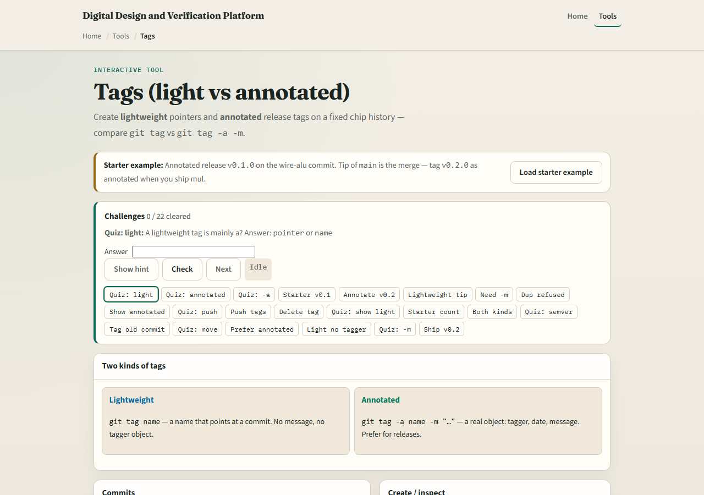
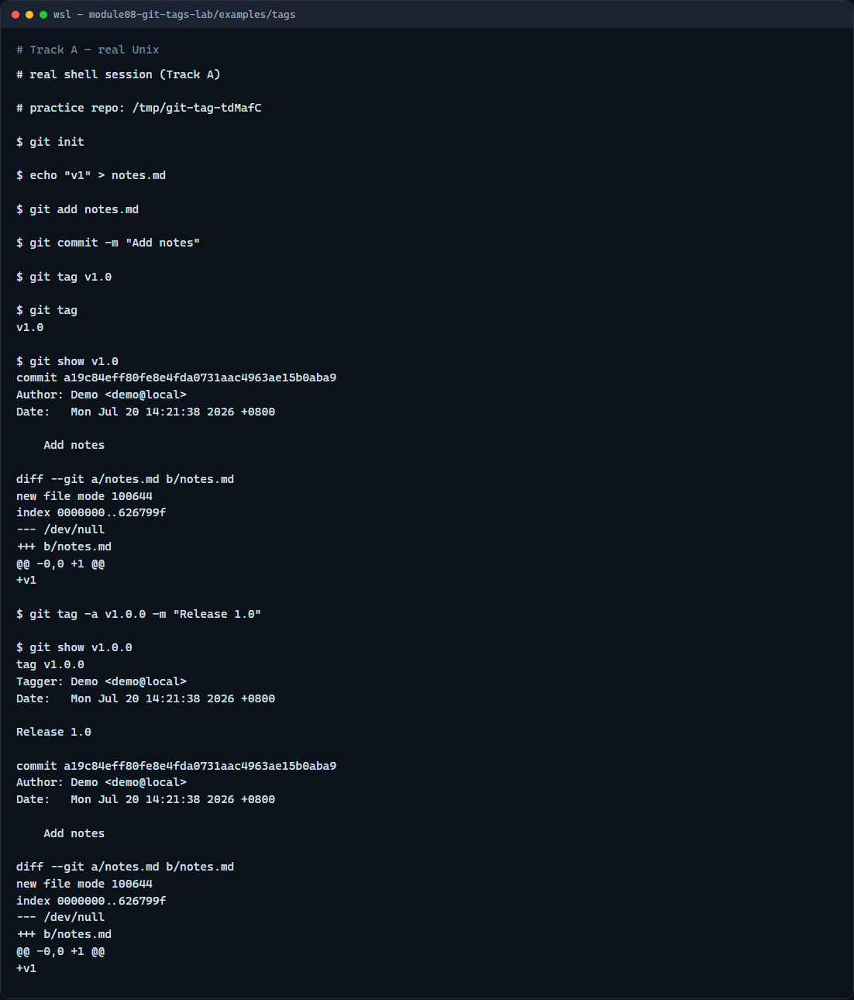

# Module 08 — Tags

**Module id:** module08-git-tags-lab  
**Lab:** git-tags-lab  
**Tracks:** A · B

## Slide 1 — Tags

Tags mark a commit you want to find again—a release, a submission snapshot, or a known-good point for bisect. Unlike a branch, a tag usually stays put. This module practices lightweight and annotated tags, and how to list and inspect them.

## Slide 2 — Lightweight vs annotated

A lightweight tag is simply a name pointing at a commit—quick for local milestones. An annotated tag stores a message, tagger, and date—better for releases you share. Use tag to list names, show to inspect one, and remember tags are not pushed with a normal push—you send them explicitly.

## Slide 3 — Browser lab



In the browser lab, look at three pieces: the challenge card, the commit list, and the create panel for lightweight versus annotated tags. Load the starter example, create one of each kind, then inspect with show. Use Check when you think a challenge is done. You do not need a full tour here—the lab itself guides the rest. Explore a few challenges, then come back for the real Git track.

## Slide 4 — Real Git practice



In the real Git track, create a tiny repo with one commit. Add a lightweight tag on that commit, list tags, and show what it points to. Then add an annotated tag with a release message on the same commit and show again—you should see the extra metadata. Those two forms are what you will use for coursework milestones and semver releases.

```bash
# git init — create a new repository here
git init

# echo … > notes.md — create and commit a tracked file
echo "v1" > notes.md
git add notes.md
git commit -m "Add notes"

# git tag v1.0 — lightweight tag on this commit
git tag v1.0

# git tag — list tag names
git tag

# git show v1.0 — inspect what the tag points to
git show v1.0

# git tag -a v1.0.0 -m "Release 1.0" — annotated tag with message
git tag -a v1.0.0 -m "Release 1.0"

# git show v1.0.0 — see tag message and commit
git show v1.0.0
```

## Slide 5 — Pitfalls to watch

Do not reuse a tag name for a different commit without deleting the old one first. Do not assume push sends tags—use push with tags or push the tag name explicitly. Prefer annotated tags for anything you publish. And remember: the browser lab is for literacy—real submission tags still live in a real repo.

## Slide 6 — Your turn

Complete the checklist for at least one track—preferably both. In the browser, load the starter and create lightweight and annotated tags on a challenge commit. On real Git, tag, list, and show in your practice tree. When you are ready, take the short quiz, then continue to the next module on branch naming.
