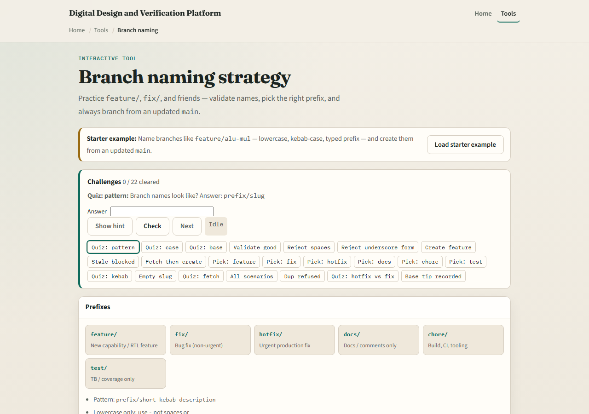
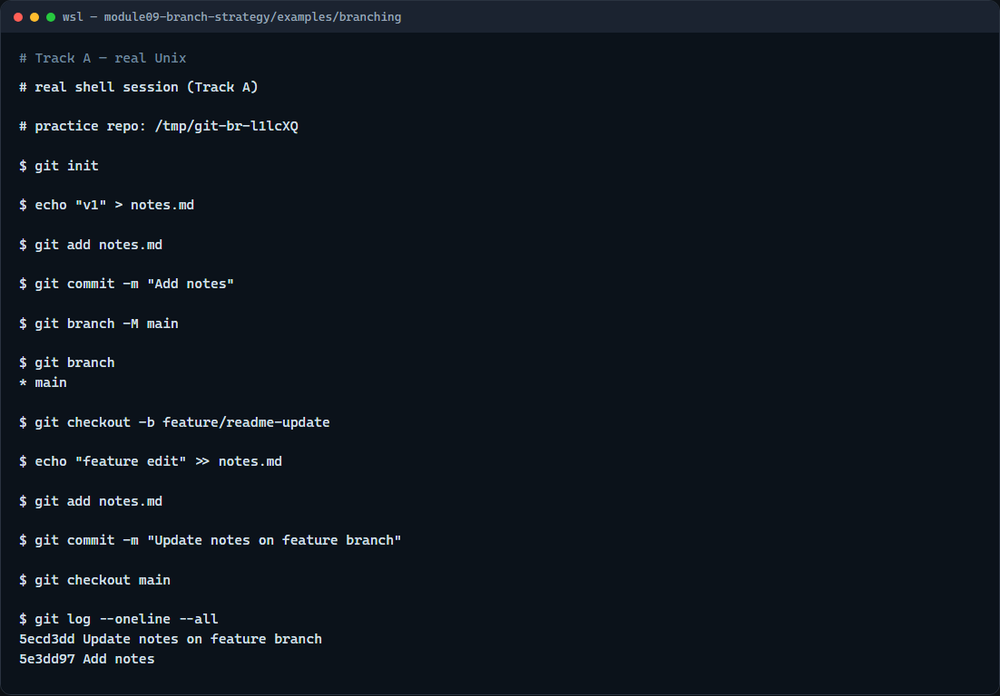

# Module 09 — Branch naming

**Module id:** module09-branch-strategy  
**Lab:** branch-strategy  
**Tracks:** A · B

## Slide 1 — Branch naming

Branches let you isolate work—a lab feature, a bugfix, a submission—without destabilizing main. Good names are short, searchable, and follow a prefix like feature or fix. This module practices naming conventions and creating branches from an updated main.

## Slide 2 — Prefix, slug, then branch

Use a typed prefix—feature slash, fix slash, hotfix slash—then a kebab-case slug that says what the branch is for. Branch from main after you have fetched the latest tip, not from random work in progress. One concern per branch keeps reviews and merges readable.

## Slide 3 — Browser lab



In the browser lab, look at three pieces: the challenge card, the prefix cheat sheet, and the name-and-create panel with validation feedback. Load the starter example, draft a name like feature slash alu-mul, and create the branch from main. Use Check when you think a challenge is done. You do not need a full tour here—the lab itself guides the rest. Explore a few challenges, then come back for the real Git track.

## Slide 4 — Real Git practice



In the real Git track, start on main with one committed file. List branches so you see the current star marker. Create and switch to a feature branch with checkout minus b and a clear name. Make a small commit on that branch, list branches again, then switch back to main and show a one-line log with all refs. That isolates the feature work until you merge it later.

```bash
# git init — create a new repository here
git init

# echo … > notes.md — create and commit on main
echo "v1" > notes.md
git add notes.md
git commit -m "Add notes"

# git branch -M main — name the default branch main
git branch -M main

# git branch — list branches; star marks current
git branch

# git checkout -b feature/readme-update — create and switch
git checkout -b feature/readme-update

# echo … >> notes.md — edit on the feature branch
echo "feature edit" >> notes.md

# git add notes.md — stage the change
git add notes.md

# git commit -m "Update notes on feature branch" — commit here
git commit -m "Update notes on feature branch"

# git checkout main — switch back to main
git checkout main

# git log --oneline --all — see both branch tips
git log --oneline --all
```

## Slide 5 — Pitfalls to watch

Do not use spaces or vague names like my branch. Do not branch from a stale main when the team expects you to fetch first. Delete merged feature branches so the list stays short. And remember: the browser lab is for literacy—real pull requests still need sensible branch names in a real repo.

## Slide 6 — Your turn

Complete the checklist for at least one track—preferably both. In the browser, load the starter and fix a few weak branch names until validation passes. On real Git, create a feature branch, commit once, and switch back to main. When you are ready, take the short quiz, then continue to the next module on merge conflicts.
