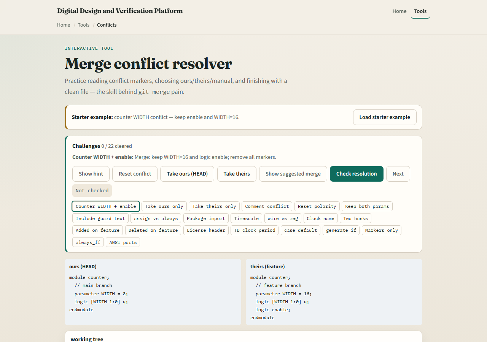
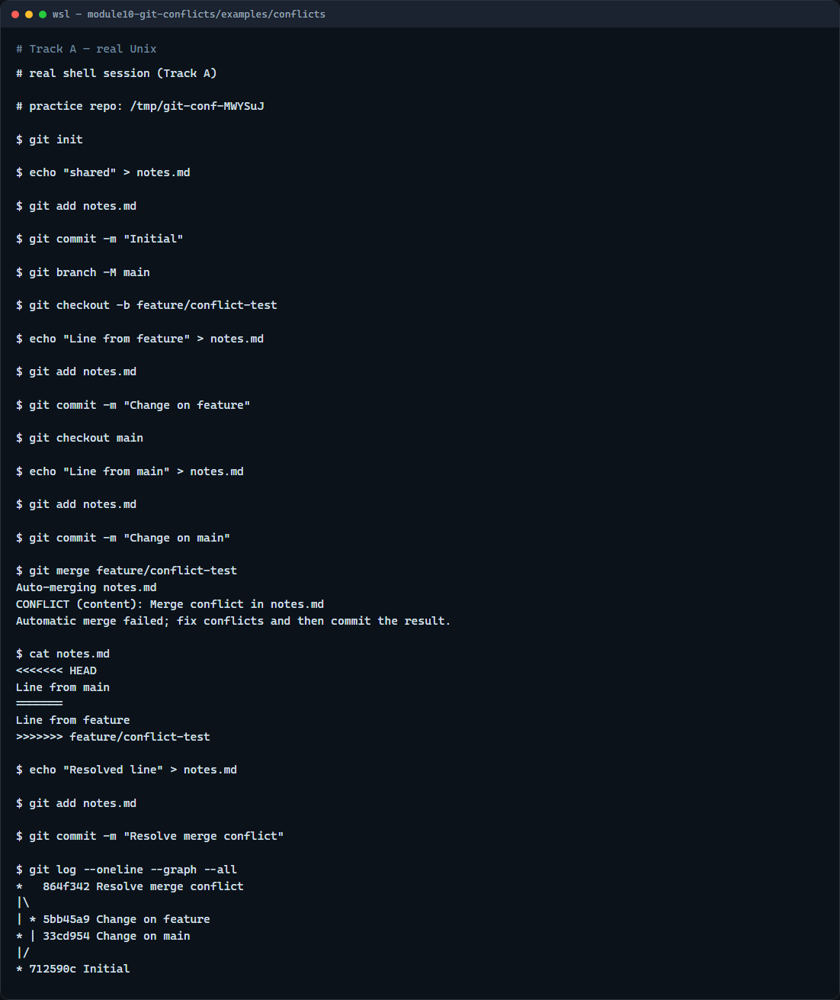

# Merge conflicts

When two branches edit the same lines, Git cannot pick a winner automatically

---

## Read the markers, then resolve
- Look for less-than signs marking HEAD, your current branch
- Edit the file until the result is what you want and every marker is gone
- Stage the fixed file, then commit to complete the merge
- In RTL work, conflicts often mean two people touched the same module, coordinate when you

---

## Browser lab


---

## Real Git practice


---

## Real Git practice — try these

```
# git init — create a new repository here
git init

# echo … > notes.md — shared starting content
echo "shared" > notes.md
git add notes.md
git commit -m "Initial"
git branch -M main

# git checkout -b feature/conflict-test — branch for a conflicting edit
git checkout -b feature/conflict-test
echo "Line from feature" > notes.md
git add notes.md
git commit -m "Change on feature"

# git checkout main — return and edit the same file differently
git checkout main
echo "Line from main" > notes.md
git add notes.md
git commit -m "Change on main"

# git merge feature/conflict-test — triggers a conflict
git merge feature/conflict-test

# edit notes.md — remove markers; keep the text you want
echo "Resolved line" > notes.md

# git add notes.md — stage the resolved file
git add notes.md

# git commit -m "Resolve merge conflict" — finish the merge
git commit -m "Resolve merge conflict"

# git log --oneline --graph --all — see the merge shape
git log --oneline --graph --all

```

---

## Pitfalls to watch
- Do not commit while conflict markers remain in the file
- Do not panic-delete both sides, read what each branch changed
- Pull and merge main into your feature branch early to shrink conflicts before review
- And remember

---

## Your turn
- Complete the checklist for at least one track, preferably both
- In the browser, load the starter and clear a few conflict regions
- On real Git, create a small conflict, resolve it, and commit the merge
- When you are ready

