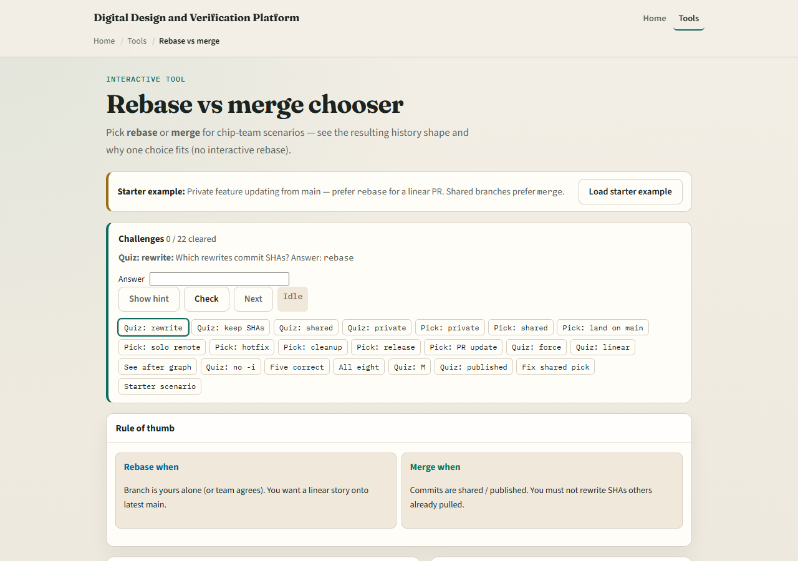
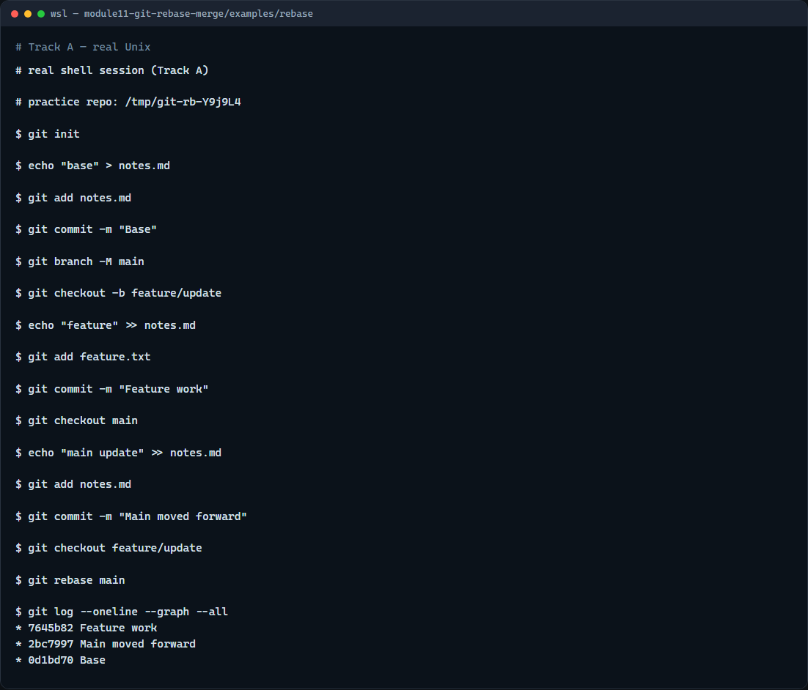

# Module 11 — Rebase vs merge

**Module id:** module11-git-rebase-merge  
**Lab:** git-rebase-merge  
**Tracks:** A · B

## Slide 1 — Rebase vs merge

Two branches diverged—now you want them together. Merge joins histories with a merge commit that has two parents. Rebase replays your branch commits on top of the other tip so the story looks linear. Neither is always wrong; the choice depends on whether the branch is shared and what your team expects in the log.

## Slide 2 — When to pick which

Rebase your own feature branch onto updated main when you want a clean, reviewable line before a pull request—and nobody else has built on your commits. Merge when integrating into a shared branch, when policy wants explicit merge commits, or when others may already have your branch checked out. Never rebase commits others are using.

## Slide 3 — Browser lab



In the browser lab, look at three pieces: the challenge card, the scenario description, and the rebase versus merge choice buttons with the resulting history sketch. Load the starter example, read each team situation, and pick the safer integration style. Use Check when you think a challenge is done. You do not need a full tour here—the lab itself guides the rest. Explore a few challenges, then come back for the real Git track.

## Slide 4 — Real Git practice



In the real Git track, build a small fork: commit on main, branch for a feature commit, then add another commit on main so the lines diverge. Check out the feature branch and rebase onto main so your work replays after the latest main tip. Show a graph log—you should see a straight line instead of a merge bubble. That is the rhythm many teams use before opening a pull request.

```bash
# git init — create a new repository here
git init

# echo … > notes.md — base commit on main
echo "base" > notes.md
git add notes.md
git commit -m "Base"
git branch -M main

# git checkout -b feature/update — start feature work
git checkout -b feature/update
echo "feature only" > feature.txt
git add feature.txt
git commit -m "Feature work"

# git checkout main — main moves forward separately
git checkout main
echo "main update" >> notes.md
git add notes.md
git commit -m "Main moved forward"

# git checkout feature/update — return to your branch
git checkout feature/update

# git rebase main — replay feature commits on latest main
git rebase main

# git log --oneline --graph --all — see linear replayed history
git log --oneline --graph --all
```

## Slide 5 — Pitfalls to watch

Do not rebase main or any branch teammates share without agreement. After you rebase a branch you already pushed, you may need force-with-lease—not a casual force push. Merge is fine when you want to preserve the exact integration moment. And remember: the browser lab is for literacy—follow your course or team policy on real repos.

## Slide 6 — Your turn

Complete the checklist for at least one track—preferably both. In the browser, load the starter and justify a few rebase versus merge picks. On real Git, rebase a feature branch onto main and read the graph. When you are ready, take the short quiz, then continue to the next module on cherry-pick.
