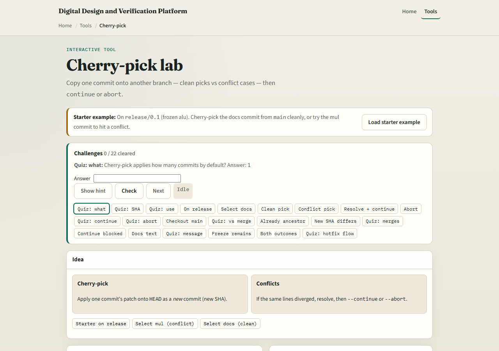
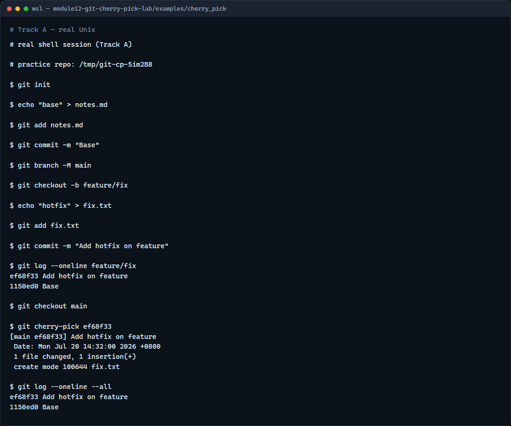

# Cherry-pick

Sometimes you want one commit from another branch, not the whole merge

---

## Find the commit, then pick it
- On the source branch, use log to find the short hash you need
- Check out the target branch, then cherry-pick that hash
- Git replays the diff; if it applies cleanly, you get a fresh commit
- If not, resolve conflicts, stage, and cherry-pick continue, or abort to undo the attempt

---

## Browser lab


---

## Real Git practice


---

## Real Git practice — try these

```
# git init — create a new repository here
git init

# echo … > notes.md — base commit on main
echo "base" > notes.md
git add notes.md
git commit -m "Base"
git branch -M main

# git checkout -b feature/fix — branch for the commit to copy
git checkout -b feature/fix
echo "hotfix" > fix.txt
git add fix.txt
git commit -m "Add hotfix on feature"

# git log --oneline feature/fix — find the commit hash
git log --oneline feature/fix

# git checkout main — target branch for the pick
git checkout main

# git cherry-pick <hash> — apply that commit onto main
git cherry-pick feature/fix

# git log --oneline --all — see the new commit on main
git log --oneline --all

```

---

## Pitfalls to watch
- Cherry-pick creates a duplicate commit
- Avoid picking merge commits unless you know parent selection
- If conflicts appear, finish with continue or abort, do not leave a half-finished pick
- And remember

---

## Your turn
- Complete the checklist for at least one track, preferably both
- In the browser, load the starter and complete a clean pick and a conflict recovery
- On real Git, cherry-pick one commit from a feature branch onto main
- When you are ready

