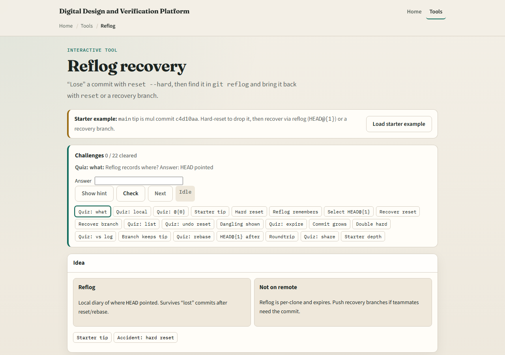
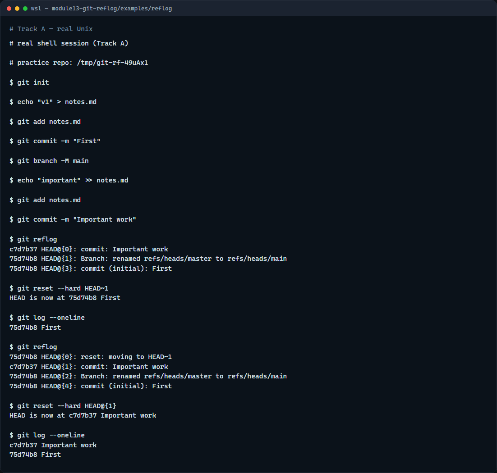

# Reflog recovery

You reset too far, checked out the wrong branch, or rebased and thought a commit was gone

---

## Reflog before panic
- Run reflog to see recent moves: commits, checkouts, resets
- Each line has an index like HEAD at one, meaning one step ago
- If a hard reset dropped your tip
- Reflog is local only and entries expire after a while, so recover soon

---

## Browser lab


---

## Real Git practice


---

## Real Git practice — try these

```
# git init — create a new repository here
git init

# echo … > notes.md — first commit
echo "v1" > notes.md
git add notes.md
git commit -m "First"
git branch -M main

# echo … >> notes.md — commit you might “lose”
echo "important" >> notes.md
git add notes.md
git commit -m "Important work"

# git reflog — see where HEAD has been
git reflog

# git reset --hard HEAD~1 — drop the latest commit from the branch tip
git reset --hard HEAD~1

# git log --oneline — latest commit no longer on the branch
git log --oneline

# git reflog — find the previous tip (e.g. HEAD@{1})
git reflog

# git reset --hard HEAD@{1} — move tip back to recover
git reset --hard HEAD@{1}

# git log --oneline — important commit is back
git log --oneline

```

---

## Pitfalls to watch
- Reflog does not travel to the remote, recovery is for your local clone
- Entries expire; do not treat reflog as permanent backup
- Prefer reset hard to HEAD at one only when you are sure that entry is the state you want
- And remember

---

## Your turn
- Complete the checklist for at least one track, preferably both
- In the browser, load the starter and recover a dropped commit from reflog
- On real Git, reset back one commit, then restore with HEAD at one
- When you are ready

