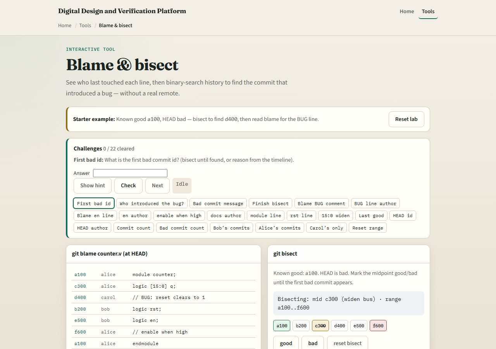
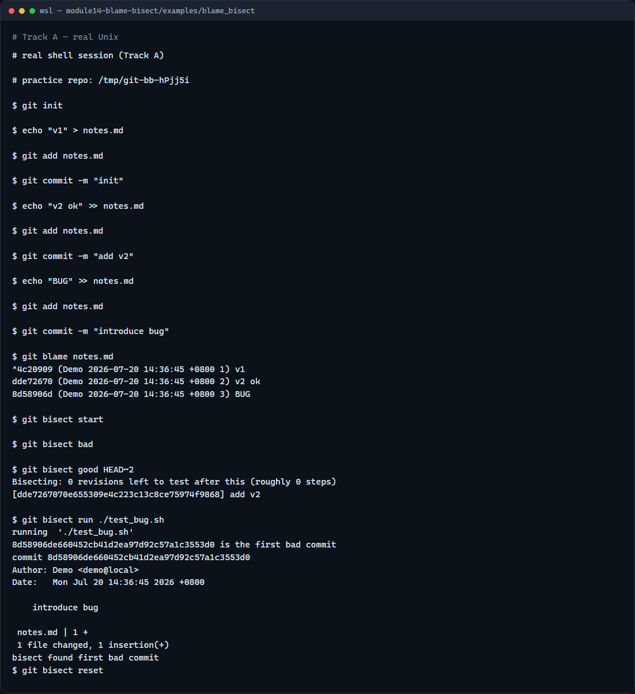

# Blame & bisect

A regression shows up in simulation, when did it start, and who touched that line?

---

## Blame the line, bisect the range
- Run blame on a file to see hash, author
- Answer good or bad until Git names the first bad commit
- Reset bisect when you are done so you are not stuck in detached state

---

## Browser lab


---

## Real Git practice


---

## Real Git practice — try these

```
# git init — create a new repository here
git init

# echo … > notes.md — first commit (known good)
echo "v1" > notes.md
git add notes.md
git commit -m "init"

# echo … >> notes.md — still good
echo "v2 ok" >> notes.md
git add notes.md
git commit -m "add v2"

# echo … >> notes.md — introduces a marker to hunt
echo "BUG" >> notes.md
git add notes.md
git commit -m "introduce bug"

# git blame notes.md — who last changed each line?
git blame notes.md

# test_bug.sh — exits 1 when notes.md contains BUG (bad revision)
# grep -q BUG notes.md && exit 1 || exit 0

# git bisect start — begin binary search
git bisect start
git bisect bad
git bisect good HEAD~2

# git bisect run ./test_bug.sh — auto-test each midpoint
git bisect run ./test_bug.sh

# git bisect reset — return to normal branch state
git bisect reset

```

---

## Pitfalls to watch
- Blame shows the last touch, not every historical edit, use log or show for deeper history
- Bisect needs a reliable good and bad test; flaky tests give flaky answers
- Always bisect reset when finished
- And remember

---

## Your turn
- Complete the checklist for at least one track, preferably both
- In the browser, finish a bisect to the first bad commit and read blame on the bug line
- On real Git, run blame and a short bisect on your practice tree
- When you are ready

