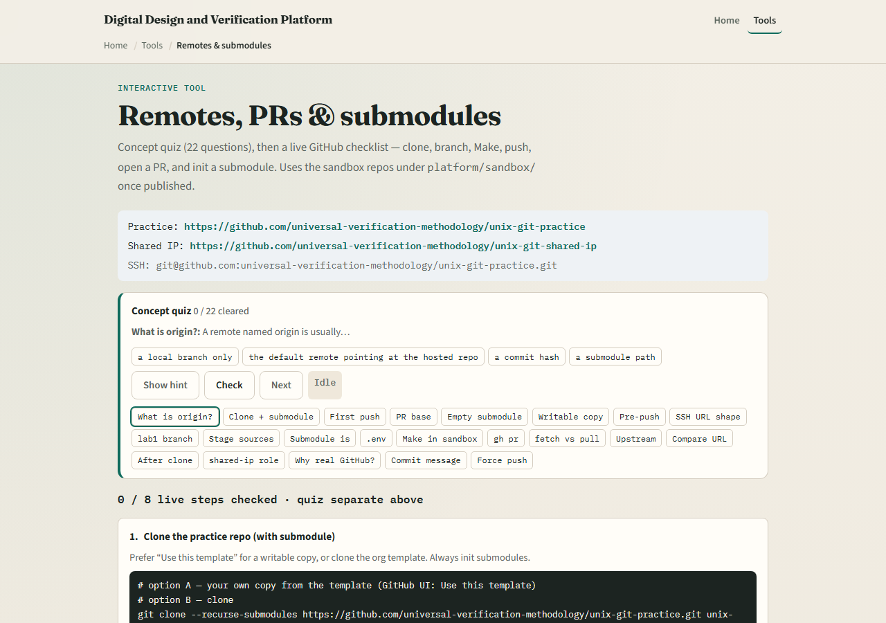
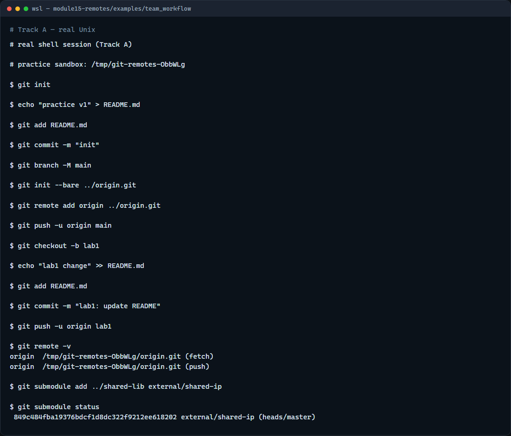

# Remotes, PRs & submodules

Local Git is only half the story

---

## Push, review, embed
- Add a remote with a URL
- Reviewers read the diff, you push more commits to the same branch if needed
- A submodule records a gitlink, the path plus an exact commit, not a casual copy of files
- After cloning a repo with submodules, you must initialize them or those folders stay empty

---

## Browser lab


---

## Real Git practice


---

## Real Git practice — try these

```
# git init — create a new repository here
git init

# echo … > README.md — first commit on default branch
echo "practice v1" > README.md
git add README.md
git commit -m "init"

# git branch -M main — name the default branch main
git branch -M main

# git init --bare ../origin.git — bare remote (simulates GitHub)
git init --bare ../origin.git

# git remote add origin … — link the hosted copy
git remote add origin ../origin.git

# git push -u origin main — publish main and set upstream
git push -u origin main

# git checkout -b lab1 — branch for lab work
git checkout -b lab1

# echo … >> README.md — edit on the lab branch
echo "lab1 change" >> README.md

# git add README.md — stage the change
git add README.md

# git commit -m "lab1: update README" — commit on lab1
git commit -m "lab1: update README"

# git push -u origin lab1 — publish lab branch with upstream
git push -u origin lab1

# git remote -v — show remote names and URLs
git remote -v

# git submodule add … external/shared-ip — pin another repo
git submodule add ../shared-lib external/shared-ip

# git submodule status — show pinned submodule commit
git submodule status

```

---

## Pitfalls to watch
- Do not force-push shared default branches like main
- After clone, run submodule init if embedded folders are empty
- A pull request is for review and visibility
- And remember

---

## Your turn
- Complete the checklist for at least one track, preferably both
- In the browser, clear a few quiz items and read the live GitHub steps end to end
- On real Git, practice push with upstream and inspect a submodule status line
- When you are ready

