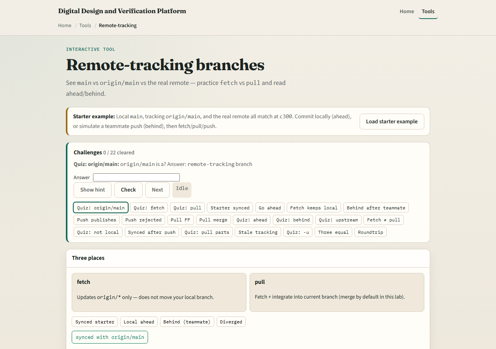
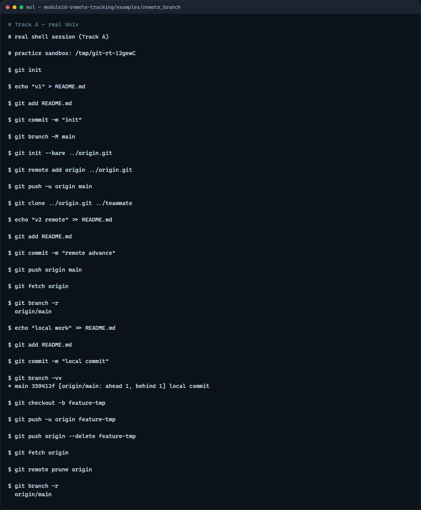

# Module 16 — Remote-tracking branches

**Module id:** module16-remote-tracking  
**Lab:** remote-tracking  
**Tracks:** A · B

## Slide 1 — Remote-tracking branches

Your laptop keeps local branches like main. Git also keeps remote-tracking refs such as origin slash main—the last tip you saw on the server after fetch or push. Status compares your local branch to that tracking ref so you know if you are ahead, behind, or diverged. This module is about reading those refs and using fetch and pull without surprises.

## Slide 2 — Fetch, track, compare

Fetch downloads new commits and updates origin slash star refs only—it does not move your local branch or working tree. Pull is fetch plus integrate into your current branch, usually a merge. Set upstream with push minus u or branch minus u so status and push know which remote branch you mean. List remote-tracking branches with branch minus r, see upstream links with branch minus v v, and prune stale origin refs after branches are deleted on the host.

## Slide 3 — Browser lab



In the browser lab, load the starter example first so local main, origin slash main, and the server all start in sync. Look at three lanes—the local branch, the remote-tracking ref, and the real remote—and the challenge panel above. Try fetch when the server moves ahead, commit locally to go ahead, then pull or push to resync. Use Check on challenges when you think you have the right state. You do not need a full tour here—the lab itself guides the rest. Explore a few challenges, then come back for the real Git track.

## Slide 4 — Real Git practice



In the real Git track, use a bare repository as origin. Push main, then simulate a teammate push from a second clone so your practice repo is behind. Fetch to refresh origin slash main without merging. List remote branches, make a local commit, and show branch minus v v with upstream info. Push a short-lived branch, delete it on the remote, fetch, and prune so the stale remote-tracking ref disappears.

```bash
# git init — create a new repository here
git init

# echo … > README.md — first commit on main
echo "v1" > README.md
git add README.md
git commit -m "init"

# git branch -M main — name the default branch main
git branch -M main

# git init --bare ../origin.git — bare remote (simulates GitHub)
git init --bare ../origin.git

# git remote add origin … — link the hosted copy
git remote add origin ../origin.git

# git push -u origin main — publish and set upstream tracking
git push -u origin main

# git clone ../origin.git ../teammate — second clone (teammate)
git clone ../origin.git ../teammate

# (in teammate) echo … >> README.md — push new commit to origin
# (in teammate) git push origin main

# git fetch origin — refresh origin/* without merging
git fetch origin

# git branch -r — list remote-tracking branches
git branch -r

# echo … >> README.md — local commit (now ahead of last fetch)
echo "local work" >> README.md

# git add README.md — stage the change
git add README.md

# git commit -m "local commit" — commit on main
git commit -m "local commit"

# git branch -vv — show upstream and ahead/behind hints
git branch -vv

# git push origin feature-tmp — publish a short-lived branch
git checkout -b feature-tmp
git push -u origin feature-tmp

# git push origin --delete feature-tmp — remove branch on remote
git push origin --delete feature-tmp

# git fetch origin — update refs after remote delete
git fetch origin

# git remote prune origin — drop stale origin/* refs
git remote prune origin
```

## Slide 5 — Pitfalls to watch

Fetch is safe—it does not change your files—but it can make status show you are behind until you pull or rebase. Do not confuse origin slash main with your local main; they diverge whenever only one side moves. Prune only removes stale remote-tracking refs, not your local branches. And remember: the browser lab is for literacy—real team repos still need disciplined fetch, pull, and push habits.

## Slide 6 — Your turn

Complete the checklist for at least one track—preferably both. In the browser, load the starter and clear a few ahead-or-behind challenges. On real Git, run fetch, read branch minus v v, and prune a deleted remote branch. When you are ready, take the short quiz, then continue to the next module on pull request review.
