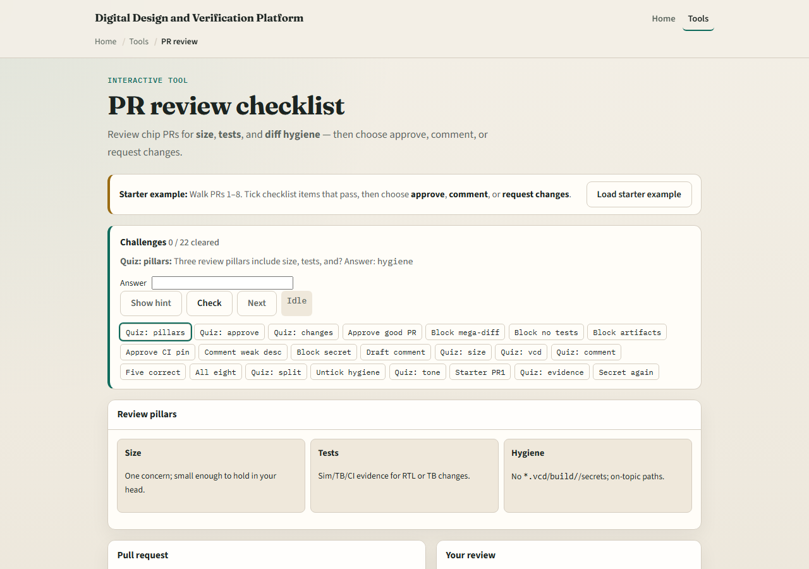
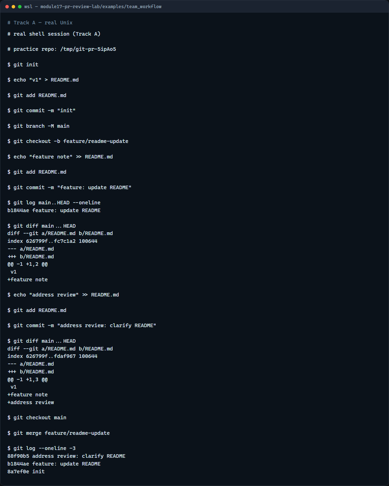

# Module 17 — PR review checklist

**Module id:** module17-pr-review-lab  
**Lab:** pr-review-lab  
**Tracks:** A · B

## Slide 1 — PR review checklist

A pull request is more than a merge button—it is a review conversation. Good reviewers ask: is the diff small enough to understand, is there test or simulation evidence, is the diff clean of build artifacts and secrets, and does the description say why and how to verify? This module trains that checklist before you submit or approve real coursework PRs.

## Slide 2 — Size, tests, hygiene, description

Keep each PR to one concern so reviewers can hold the change in their head. RTL or testbench edits should mention how you verified—make sim, a TB run, or a green CI job. Hygiene means no wave dumps, log files, or secrets in the diff—only source and docs that belong in version control. The description should explain what changed and how a reviewer can reproduce your result. Approve when all four pass, comment for nits or missing context, and request changes when something blocks merge.

## Slide 3 — Browser lab



In the browser lab, load the starter example and walk the sample pull requests. Look at three regions: the review checklist on the right, the diff sketch in the middle, and the challenge panel above. Tick size, tests, hygiene, and description when each passes, then choose approve, comment, or request changes. Use Check on challenges when your verdict matches the scenario. You do not need a full tour here—the lab itself guides the rest. Review a few PRs, then come back for the real Git track.

## Slide 4 — Real Git practice



In the real Git track, create a small feature branch from main with one focused commit. Show the commit range your reviewer would see with log and diff against main. Add a follow-up commit as if you addressed review feedback, then inspect the updated diff. Finally merge into main locally—the same end state as an approved pull request on GitHub.

```bash
# git init — create a new repository here
git init

# echo … > README.md — first commit on main
echo "v1" > README.md
git add README.md
git commit -m "init"

# git branch -M main — name the default branch main
git branch -M main

# git checkout -b feature/readme-update — branch for the PR
git checkout -b feature/readme-update

# echo … >> README.md — one focused change
echo "feature note" >> README.md

# git add README.md — stage only the intended file
git add README.md

# git commit -m "feature: update README" — small, descriptive commit
git commit -m "feature: update README"

# git log main..HEAD --oneline — commits the PR would add
git log main..HEAD --oneline

# git diff main...HEAD — full diff a reviewer reads
git diff main...HEAD

# echo … >> README.md — address review feedback
echo "address review" >> README.md

# git add README.md — stage the fix
git add README.md

# git commit -m "address review: clarify README" — second commit on same branch
git commit -m "address review: clarify README"

# git diff main...HEAD — updated PR diff after push
git diff main...HEAD

# git checkout main — switch to integration branch
git checkout main

# git merge feature/readme-update — merge after approval
git merge feature/readme-update

# git log --oneline -3 — see merged history
git log --oneline -3
```

## Slide 5 — Pitfalls to watch

Do not approve mega-diffs that mix refactor with feature work—ask for a split. Never merge secrets or generated waves even if the RTL change is correct. A thin description on a risky fix deserves request changes, not a silent approve. Draft or work-in-progress PRs get light comments, not the same bar as ready-to-merge. And remember: the browser lab is for literacy—real team reviews still need your judgment on every diff hunk.

## Slide 6 — Your turn

Complete the checklist for at least one track—preferably both. In the browser, load the starter and practice approve versus request changes on a few PRs. On real Git, review a branch with log and diff before merging. When you are ready, take the short quiz, then continue to the next module on submodule pitfalls.
