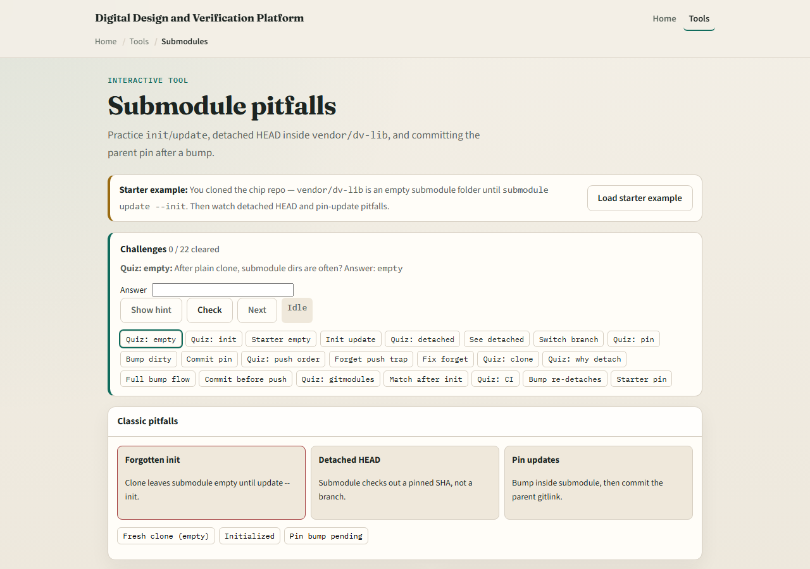
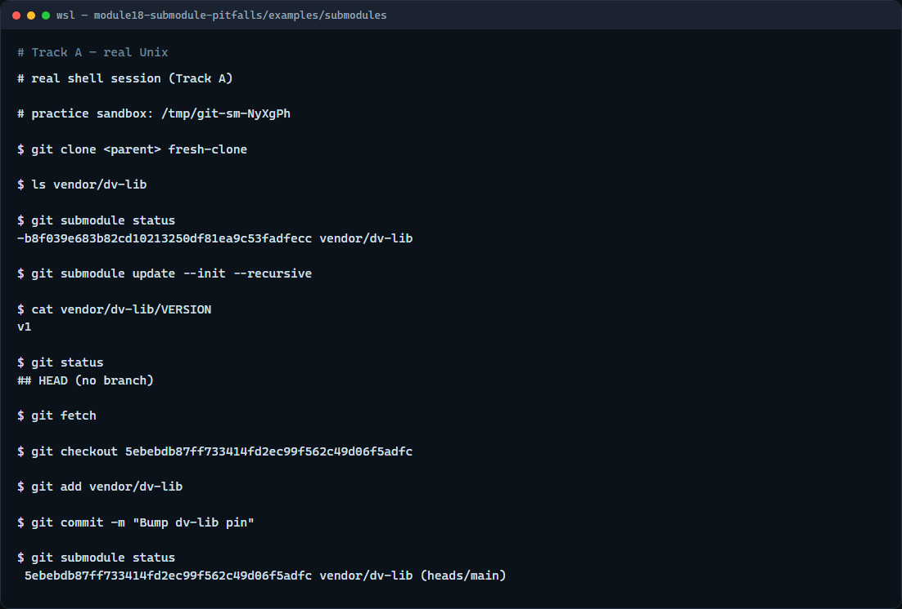

# Submodule pitfalls

A submodule embeds another repository at a pinned commit, the parent stores a gitlink, not a copy of every file

---

## Init, detached HEAD, pin bumps
- After a normal clone
- Inside the submodule, detached HEAD is normal
- To move the pin
- Push the submodule commit to its remote first if needed, then push the parent
- Two repos, two push steps, easy to forget one

---

## Browser lab


---

## Real Git practice


---

## Real Git practice — try these

```
# (setup) parent repo pins vendor/dv-lib at lib v1

# git clone <parent> fresh-clone — clone without submodules populated
git clone file://…/parent fresh-clone

# ls vendor/dv-lib — empty until init
ls vendor/dv-lib

# git submodule status — minus prefix means not initialized
git submodule status

# git submodule update --init --recursive — populate submodule checkout
git submodule update --init --recursive

# cat vendor/dv-lib/VERSION — library files appear
cat vendor/dv-lib/VERSION

# cd vendor/dv-lib — enter the submodule
cd vendor/dv-lib

# git status — detached HEAD at the pinned commit
git status

# git fetch — see newer library commits
git fetch

# git checkout <new-sha> — move submodule to newer pin candidate
git checkout <new-sha>

# cd ../.. — back to parent repo root
cd ../..

# git add vendor/dv-lib — stage the new gitlink
git add vendor/dv-lib

# git commit -m "Bump dv-lib pin" — parent records the new pin
git commit -m "Bump dv-lib pin"

# git submodule status — verify pin moved
git submodule status

```

---

## Pitfalls to watch
- An empty vendor or external folder after clone almost always means forgotten init
- Do not commit only inside the submodule and stop; the parent must record the new SHA
- Detached HEAD inside a submodule is expected until you deliberately switch a branch for
- CI should clone with recurse submodules or run init in the build script
- And remember

---

## Your turn
- Complete the checklist for at least one track, preferably both
- In the browser, load the starter and fix init, detached HEAD, and pin-update scenarios
- On real Git, clone, init, inspect status inside the submodule, and bump the parent pin
- When you are ready

