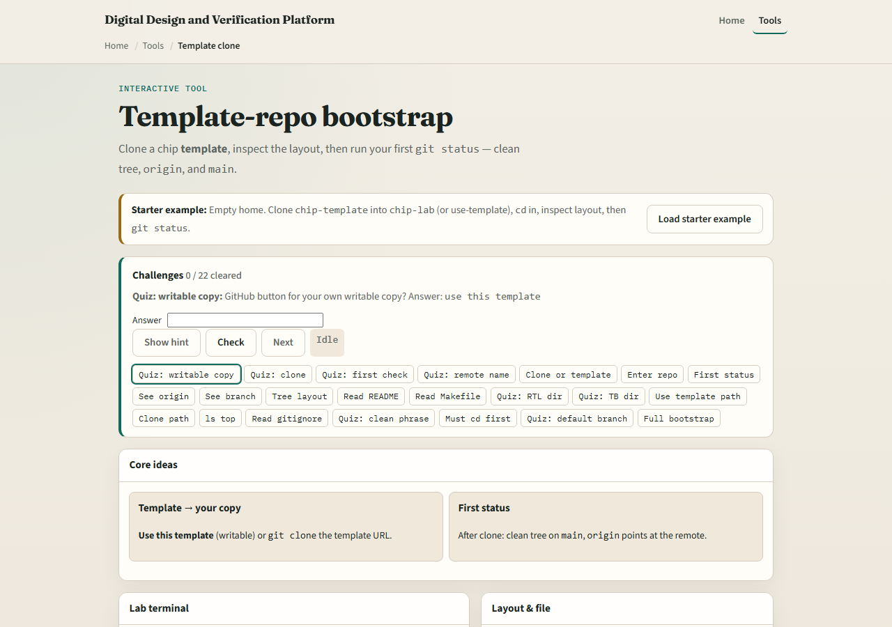
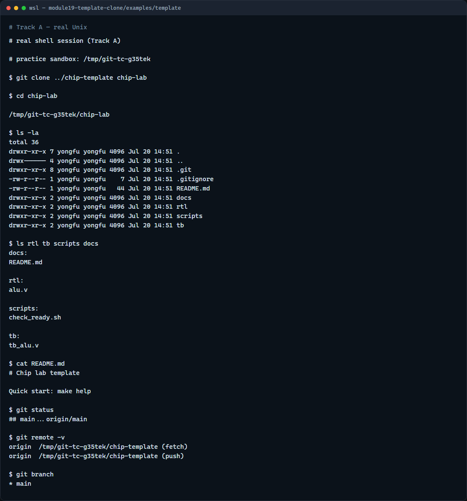

# Template-repo bootstrap

Course labs often start from a template repository, not a blank folder

---

## Clone, map, status
- Clone the template URL into a project folder, change into it, and list the top level
- Expect directories like rtl, tb, scripts
- Run status right away
- Read gitignore and env example files so you know what not to commit
- Map the layout before you write new code

---

## Browser lab


---

## Real Git practice


---

## Real Git practice — try these

```
# (setup) chip-template repo with rtl/, tb/, scripts/, docs/

# git clone <template-url> chip-lab — copy template into your workspace
git clone ../chip-template chip-lab

# cd chip-lab — work inside the new project
cd chip-lab

# ls -la — see top-level files and folders
ls -la

# ls rtl tb scripts docs — map source, tests, and tooling
ls rtl tb scripts docs

# cat README.md — read quick-start notes
cat README.md

# git status — confirm clean tree on main
git status

# git remote -v — see where origin points
git remote -v

# git branch — confirm current branch name
git branch

```

---

## Pitfalls to watch
- Clone into a fresh folder name, you do not want to nest a repo inside another by accident
- If status is not clean immediately after clone, find out why before you start editing
- Do not commit env files with secrets, copy from env example instead
- And remember

---

## Your turn
- Complete the checklist for at least one track, preferably both
- In the browser, load the starter, bootstrap chip-lab, and run your first status
- On real Git, clone a template tree and map rtl, tb, and scripts
- When you are ready

