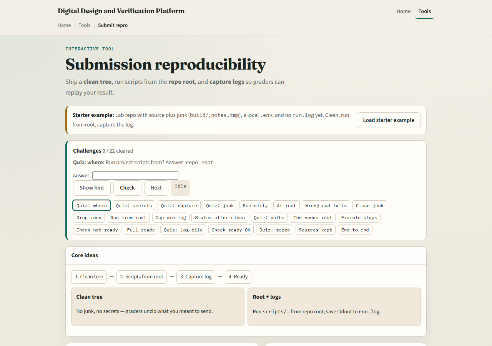
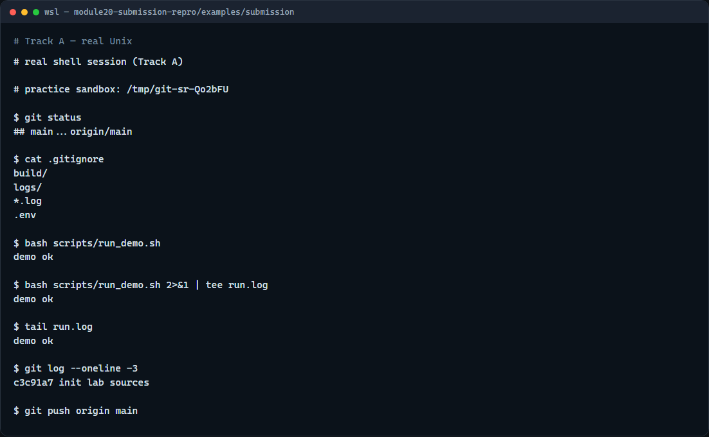

# Module 20 — Submission reproducibility

**Module id:** module20-submission-repro  
**Lab:** submission-repro  
**Tracks:** A · B

## Slide 1 — Submission reproducibility

Before you push or zip a lab, ask: can a grader reproduce your result from a clean checkout? That means a working tree without stray junk, scripts run from the repo root, and evidence captured in a log file. Secrets stay out—ship env example, not your real env file. This module trains the pre-submission checklist so your GitHub repo matches what you actually tested.

## Slide 2 — Clean, root, log, push

Run status and confirm build artifacts and logs are gitignored, not accidentally staged. Remove local secrets and scratch files graders should never see. Run demo or test scripts from the repository root so relative paths match the README. Capture stdout and stderr with tee into run dot log so reviewers see what you saw. Then push and verify on the host that only the right files and commits appear.

## Slide 3 — Browser lab



In the browser lab, load the starter example—a lab repo with source plus junk, a local env file, and no run log yet. Look at the submit checklist, the file tree, and the challenge panel above. Clean junk, run from root with tee, and pass the ready checks. Use Check when your tree matches the challenge. You do not need a full tour here—the lab itself guides the rest. Work a few challenges, then come back for the real Git track.

## Slide 4 — Real Git practice



In the real Git track, start in a small chip-lab repo with gitignore rules for build and logs. Check status, read gitignore, run the demo script from the repo root and tee output to run dot log. Show a short log tail and status again so you know what you would push.

```bash
# git status — see tracked vs ignored files before submit
git status

# cat .gitignore — confirm build/, logs/, and .env are excluded
cat .gitignore

# bash scripts/run_demo.sh — run the demo from repo root
bash scripts/run_demo.sh

# bash scripts/run_demo.sh 2>&1 | tee run.log — capture stdout and stderr
bash scripts/run_demo.sh 2>&1 | tee run.log

# tail run.log — verify the log captured success output
tail run.log

# git log --oneline -3 — confirm recent commits look right
git log --oneline -3

# git push origin main — publish when checks pass (needs remote)
git push origin main
```

## Slide 5 — Pitfalls to watch

Running scripts from a subdirectory breaks relative paths—check pwd first. Never commit env files with real tokens; copy from env example instead. A dirty tree with surprise untracked files means you might zip or push the wrong snapshot. Capture the log only after a successful root run, not from a failed attempt in the wrong folder. And remember: the browser lab is for literacy—real submissions still need your sandbox push and GitHub verification.

## Slide 6 — Your turn

Complete the checklist for at least one track—preferably both. In the browser, load the starter and get to ready with a clean tree and run dot log. On real Git, practice status, root run, and log capture before push. When you are ready, take the short quiz, then continue to the live sandbox module on clone, make, and pull request.
