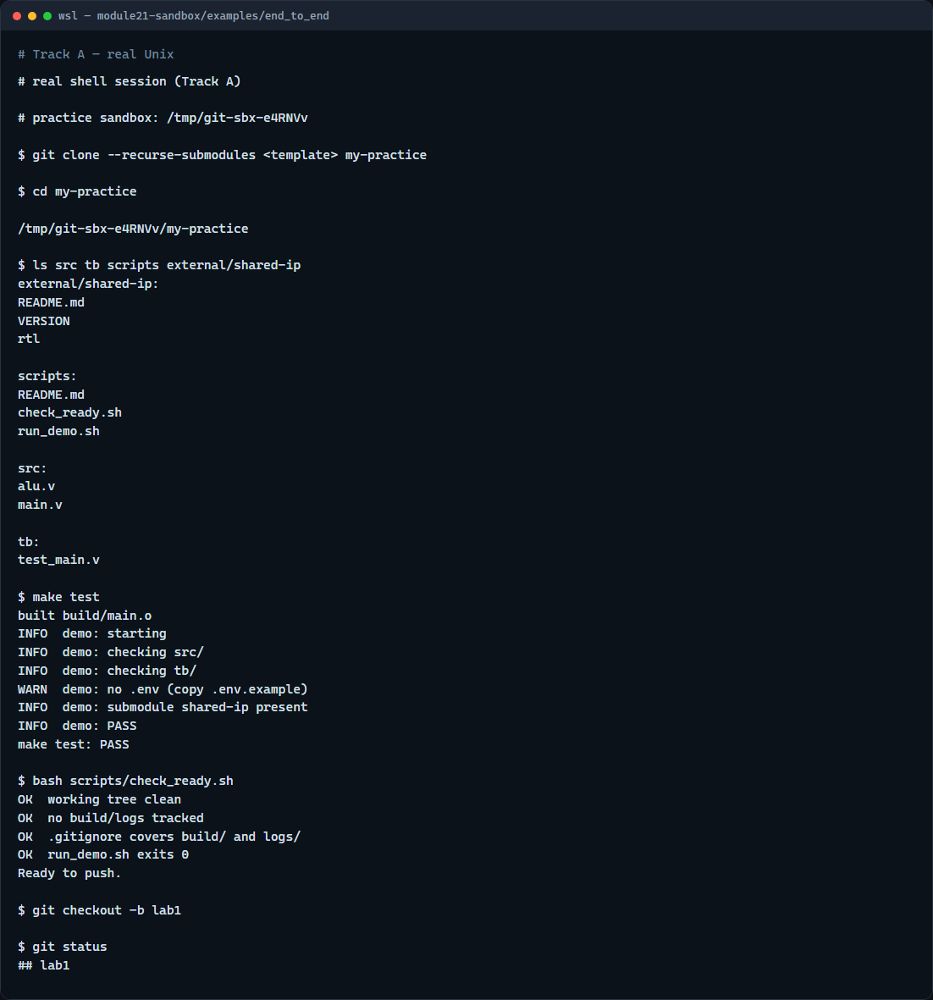

# Live sandbox capstone

Browser labs taught the ideas, now you rehearse on a real GitHub template

---

## Sandbox, not the curriculum repo
- The learn Git course tree is for reading modules and local examples
- The org template is your practice surface
- That gives you src, tb, scripts
- Read the sandbox note once so you know which URL is which

---

## Capstone workflow
- Here is the end-to-end rhythm
- On GitHub, generate your repo from the unix-git-practice template
- Clone with recurse submodules so shared-ip is populated
- Change into the project and run make test to exercise the stub build and demo script
- Run the check-ready script before you push
- Create a lab branch, commit a small change, push to your fork

---

## Real Git practice


---

## Real Git practice — try these

```
# git clone --recurse-submodules <your-template-url> my-practice
git clone --recurse-submodules <your-template-url> my-practice

# cd my-practice — enter the cloned sandbox
cd my-practice

# ls src tb scripts external/shared-ip — map the layout
ls src tb scripts external/shared-ip

# make test — run stub build and demo checks
make test

# bash scripts/check_ready.sh — pre-push readiness script
bash scripts/check_ready.sh

# git checkout -b lab1 — branch for lab work
git checkout -b lab1

# git status — confirm branch and working tree
git status

```

---

## Pitfalls to watch
- Do not push assignments into the curriculum learn Git repository, use your template fork
- Always clone with recurse submodules or run submodule init afterward
- Run make and check-ready from the repo root, not a subdirectory
- And remember

---

## Your turn
- Complete the sandbox checklist on your fork or an explore-only clone
- Clone with submodules, run make test
- When you are ready

