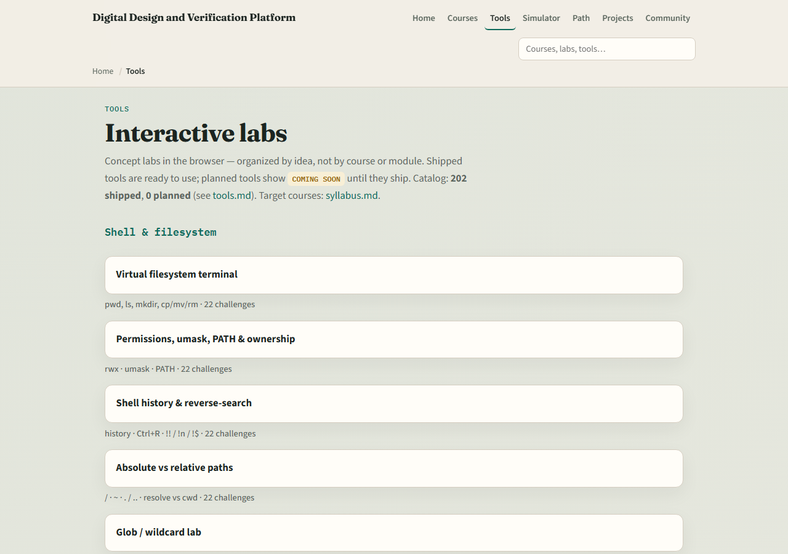

# Git path complete

You have walked the Git path for coursework, from the mental model of working tree, index

---

## What you can do now
- You can explain how files move from working tree to index to commit graph
- You can stage, commit, read history, and undo safely
- You can branch, merge or rebase, and recover with reflog when something goes wrong
- Rehearse a reproducible submission
- That is the Git literacy every later design course expects

---

## Close the track gaps
- The sandbox so push and pull feel natural, not only the concept quizzes
- Remote-tracking
- Either track works for self-study; both together stick best before you move on

---

## The tools you practiced
- Here is the tools index again, the same shelf of concept labs you opened along the way
- You do not need to re-clear every challenge
- Use it as a map

---

## Next
- Complete the quiz for this part
- Digital design and Verilog courses assume you can commit cleanly, read a log

---

## Your turn
- Review the wrap checklist in the module README
- Confirm you can run status and log without guessing
- When you are ready, take the short quiz, then open the next course that matches your path

